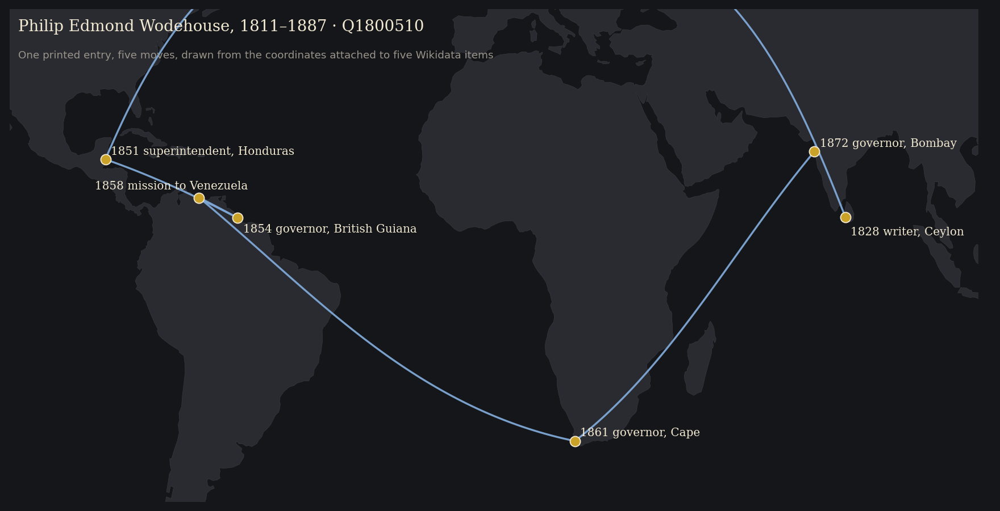
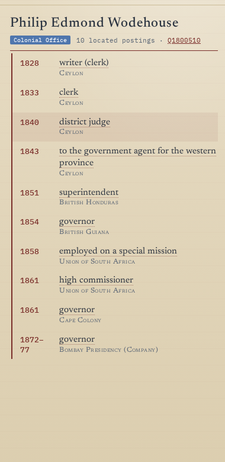
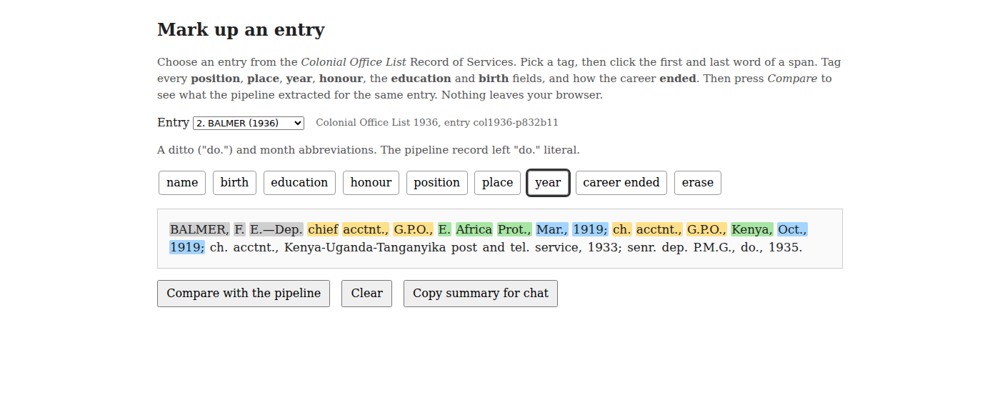
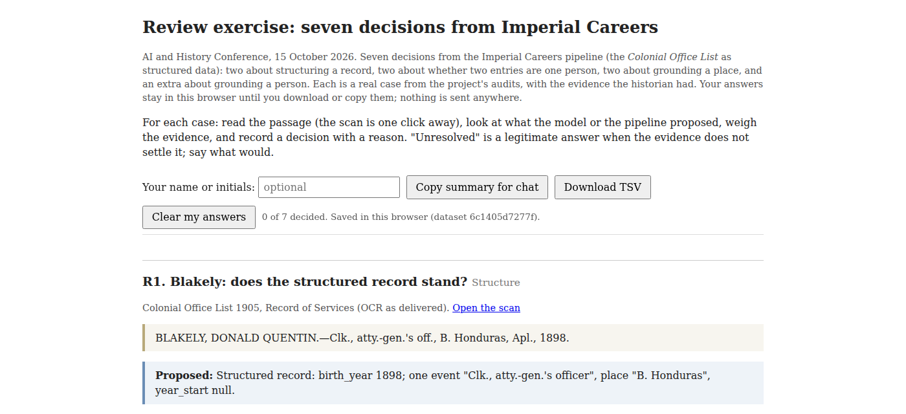

## {background-video="https://jimclifford.ca/col_matching/combined_mobility.mp4" background-video-muted="true" background-image="images/combined-mobility-frame.jpg" background-size="cover"}

::: notes
Let it run. 56 seconds. Every arc is one official moving between colonies, 1815 to 1966. Say nothing until the arcs reach Africa. If the network is down, play the downloaded mp4 instead; the still behind this slide is a frame from it.
:::

## What one arc needs {.smaller}

> WODEHOUSE, SIR PHILIP E., K.C.B.—Entered the Ceylon civil service as a writer, May, 1828; … district judge of Kandy, 1840; … superintendent of Honduras, 1851; in Feb. 1854, governor of British Guiana; was employed in 1858 on a special mission to the government of Venezuela; and in 1861 was appointed governor of the Cape of Good Hope; is also high commissioner in South Africa.

| As printed | Event | Place, as printed | Identifier | Seat | Lat, long | Year |
|---|---|---|---|---|---|---|
| "writer, May, 1828" | writer | Ceylon | Q918153 British Ceylon | Colombo | 6.93, 79.86 | 1828 |
| "superintendent of Honduras, 1851" | superintendent | British Honduras | Q1643555 | Belize | 17.5, −88.2 | 1851 |
| "governor of British Guiana" | governor | British Guiana | Q918126 | Georgetown | 6.81, −58.15 | 1854 |
| "governor of the Cape of Good Hope" | governor | Cape Colony | Q370736 | Cape Town | −33.93, 18.42 | 1861 |
| "governor of Bombay" (India Office List) | governor | Bombay Presidency | Q891827 | Bombay | 18.97, 72.83 | 1872–77 |

::: notes
Colonial Office List 1867. Each row is the three questions answered once: what is the event, which entry is this man (both Lists), which place and so which coordinates. The year orders the arcs. The same work, 36,431 times.
:::

## One entry on the map

{height="600"}

## And what the map got wrong {.smaller}

:::: {.columns}
::: {.column width="38%"}
{height="520"}
:::
::: {.column width="62%"}
The atlas's own panel for the same man, Colonial Office record:

- 1858 "employed on a special mission" → **Union of South Africa**. The source says Venezuela. Venezuela is no colony, so the event fell through to the next one.
- 1861 "high commissioner" → **Union of South Africa**, seated at Bloemfontein. The Union dates from 1910. In 1861 he was high commissioner *for* South Africa, from Cape Town.
- 1851 "Honduras" → seat **Belmopan**, a capital founded in 1970.

[Seen on the map. Next: fix the rule, rerun for everyone.]{.gold}
:::
::::

::: notes
Found while preparing this slide, 7 October 2026. Not yet fixed in col_matching: say so. Both records (CO and IO) have errors visible in the panel; the IO record also inherits British Guiana for Honduras. The 1861 row is a side-effect of the South Africa fix on slide 26: the patched cache sends the bare surface "South Africa" (38 events) to Q193619, the Union, and pre-1910 that is wrong. The fix for one error made the next one; that is why you look again at everyone a rule touched.
:::

## What that was

::: {.big}
[46,926]{.gold} officials  
[305,164]{.gold} career events  
[211,581]{.gold} of them on the map
:::

 

Two printed reference books. One historian, a coding agent, a few months.

::: notes
CO 27,526 people / 180,470 events / 131,343 placed. IOL 19,400 / 124,694 / 80,238. 36,431 arcs. 186 people in both services; Wodehouse.
:::

## Ten years ago

| | Trading Consequences, 2013 | Imperial Careers, 2026 |
|---|---|---|
| [Clean]{.gold} | OCR turned "lime" into "time"; fixes hand-built by a team | OCR garbles a surname; a merge rule and a ledger |
| [Structure]{.gold} | A six-stage pipeline built by computational linguists | A prompt, and a cheap model overnight |
| [Ground]{.gold} | A gazetteer, matched by string; every "Italy" landed in Texas | Wikidata, matched by meaning; "Victoria" six ways |

 

Five institutions and a grant. Of the places it found, six in ten were right; of the places there, it found six in ten.

One historian and a coding agent.

::: notes
Clifford, Alex, Coates, Klein, Watson, Historical Methods 2016. 10.5 million pages. F-scores 0.62 commodities, 0.61 locations: precision and recall both about 0.6. What changed is who writes the pipeline and how fast the loop runs; what did not change is where the historian is needed.
:::

## Three questions

| | The question | You decide |
|---|---|---|
| [Structure]{.gold} | What is a record here? | What counts as an event |
| [Clean]{.gold} | One person or two? | Merge, keep apart, review |
| [Ground]{.gold} | Which place, which person? | Supported, unresolved, wrong |

 

The model does everything around the decision, a hundred thousand times.

## The second half of the method

::: {.big}
Build. Extract. [Visualise.]{.gold} [See.]{.gold} Fix. Rerun.
:::

 

The atlas was built to answer a question.
It turned out to be the best error detector the project had.

## The source {background-color="#1d1e23"}

> BALMER, F. E.—Dep. chief acctnt., G.P.O., E. Africa Prot., Mar., 1919; ch. acctnt., G.P.O., Kenya, Oct., 1919; ch. acctnt., Kenya-Uganda-Tanganyika post and tel. service, 1933; senr. dep. P.M.G., <mark>do.</mark>, 1935.

85 volumes, 1883 to 1966.\
1,400 to 2,900 entries in each.\
The same man in forty of them.

::: notes
Record of the Public Services of Officers. Cumulative. OCR'd with olmOCR; we begin after OCR.
:::

## Mark one up

:::: {.columns}
::: {.column width="72%"}

:::
::: {.column width="28%"}
{width="240" fig-alt="QR code for the mark-up exercise"}
:::
::::

**jimclifford.ca/imperial-careers-workshop/annotate/** or the paper. Three minutes.

# Structure {background-color="#1d1e23"}

What is a record here?

## Python, a cheap model, Python

| | | |
|---|---|---|
| **1. Python** | a grammar for the entry shape | refuses anything it cannot fully parse |
| **2. Qwen3.6-35B** | one entry in, one structured record (JSON) out | run-on, ditto and concurrent clauses |
| **3. Python** | every place and year checked against the source | systematic errors fixed by rule |

 

::: {.big}
[30,496]{.gold} entries · [8.2]{.gold} hours · [1]{.gold} a second · [55]{.gold} failures
:::

::: notes
IOL run, overnight 25–26 June, 16 workers, reasoning off, temp 0. Reasoning on: 67% failures. COL: 34,743, about a day including setup.
:::

## The prompt is the decisions

> Extract ONLY what is printed; never invent or infer facts.

> **events:** one object per distinct posting. EXPLODE compound clauses.

> **place:** as printed. No place in the clause? Carry the previous one and say so.

> **birth_year:** only if printed. NEVER infer from the earliest career date.

Every rule is there because a run broke it.

## Samples read against the source

::: {.big}
Early entries: [69%]{.gold} clean\
Across the corpus: [about 50%]{.gold} clean, [9%]{.gold} major
:::

Three samples (186, 100, 300), read by a model against the source, before the rule fixes.

| Source | Record |
|---|---|
| "senr. dep. P.M.G., **do.**, 1935" | place: "do." |
| "BLAKELY … atty.-gen.'s off., B. Honduras, **Apl., 1898**." | birth_year: **1898** |
| "**KT. BACH.** (1920)" | two honours: KT; BACH |

## Not a bigger model

The errors are systematic, so the fixes are rules:

- merge `KT` + `BACH` into Knight Bachelor
- forward-fill a "do." place, and say it was inherited
- "officer in chief" back to "officer in charge"
- stop pre-expanding "off." at all

Every change logged on the record. Zero cost per entry.

# Clean {background-color="#1d1e23"}

One person or two?

## Forty editions, one person

::: {.big}
A missed link is recoverable.
A false merge is not.
[Ties resolve to no merge.]{.gold}
:::

 

Deterministic passes first.\
Then a model argues each leftover cluster from a dossier. 917 so far, each with its reason.

## Two clusters

:::: {.columns}
::: {.column width="50%"}
**ABERY, Joseph**\
M.B.C.M. · 1867 Ceylon, asst. colonial surgeon · one edition

**CARBERY, Joseph**\
M.B.C.M. · 1867 Ceylon, asst. colonial surgeon · six editions

[Merge.]{.gold} An OCR garble with one identical event.
:::
::: {.column width="50%"}
**A'BECKETT, Thomas, b. 1836**\
Lincoln's Inn · Victorian puisne judge · knighted 1909

**BECKETT, Thomas Rumbold, b. 1898**\
Judd School · Nigeria, telegraph engineer

[Keep apart.]{.gold} Sixty-two years and nothing shared.
:::
::::

# Ground {background-color="#1d1e23"}

Which place, which person?

## Why ground

Every arc needs coordinates for "the Central Provinces", "British Guiana", "Jodhpur".

Wikidata has the item, or the capital that has the coordinates. One query.

 

And: a historian of the Cape and a historian of Bombay who both ground to **Q1800510** have joined their data without meeting.

## Live: the lookup

1. "Henry Trimen botanist Ceylon Peradeniya" → read the statements → [supported]{.gold}
2. "Ferdinando Hamlyn Price" → Q123279571, b. 1855, Tamil description only → [supported]{.gold}, and the pipeline's gate had rejected it
3. "Elwood D'Arcy Tibbits Antigua" → nothing → [unresolved]{.gold}, record the search

::: notes
WikidataMCP vector search. Saved results in outputs/ground-test/ if the network fails.
:::

## Ask a chatbot instead

::: {.big}
[0]{.gold} of 16
:::

Gemini 3.8 Flash, no tools, the same twenty entries.

Alfred Sharpe → a species of orchid. Richard Wilkinson → Thoth.
Nyasaland → a disambiguation page. Joseph Chamberlain → a Swiss footballer.

 

**It knew who. It did not know the number.**

## Four ways to get the number

| | No tools | Pipeline | Opus, retrieval | Astra, retrieval |
|---|---|---|---|---|
| People right | [0]{.gold} of 16 | 12 given; Opus confirms all 12 | [16]{.gold} of 16 | [16]{.gold} of 16 |
| Places | 38 of 104, modern | 3,207 surfaces | 17 of 138, stopped | 104, period entities |
| Time | 5 min | overnight, corpus | 20 min | 27 min |

 

27 minutes for 20 entries is 25 days for one List.
The retrieval columns are the review queue, not the corpus.

::: notes
George V from memory: Q269 is Tashkent; Opus caught it by reading the page. Gorges has two items. Harris b. 1858 vs item 1855.
:::

# The map finds the errors {background-image="images/atlas-screenshot.png" background-opacity="0.15"}

## Three errors

| Seen on the map | Cause | Fix |
|---|---|---|
| A premier of British Columbia with a seat in Melbourne | "Victoria" grounded once, by string | Resolve per person |
| The Union of South Africa at Harare: 960 events | "South Africa" matched inside "British South Africa Company" | Five cache rows; a guard on the join |
| Two Baluchistans | One under Q843, Pakistan | One canonical row |

 

Fix the **rule**, re-emit **both corpora**, look at **everyone the rule touched**.

## What the map cannot find

::: {.big}
[76%]{.gold}
:::

of the judge's "different" verdicts were wrong in the rare-surname, overlapping-era stratum.

No map shows a missed merge. For that: 200 hand-labelled cases, risky strata oversampled.

## Exercise

:::: {.columns}
::: {.column width="55%"}

{height="200" fig-alt="QR code for the decision exercise"}
:::
::: {.column width="45%"}
**jimclifford.ca/imperial-careers-workshop/review/**

[Structure]{.gold} Blakely, Balmer\
[Clean]{.gold} Abery, A'Beckett\
[Ground]{.gold} South Africa, Brewster\
[Extra]{.gold} Price

Write the reason.\
Zoom: **Copy summary for chat**.
:::
::::

## Your own data

- One question, one small sample, the page reachable
- Build the view early. It is your error detector
- Local identifiers first. None from memory
- Ground to the historical entity, per person
- Ties resolve to no merge
- Fix the rule, not the record. Make the correction a test
- A frontier model writes the pipeline; a cheap one reads the collection

## Three questions {background-image="images/atlas-screenshot.png" background-opacity="0.1"}

| | | You decide |
|---|---|---|
| [Structure]{.gold} | What is a record here? | What counts as an event |
| [Clean]{.gold} | One person or two? | Merge, keep apart, review |
| [Ground]{.gold} | Which place, which person? | Supported, unresolved, wrong |

{height="150" fig-alt="QR code for the workshop site"}

**jimclifford.ca/imperial-careers-workshop** · glossary, answers, both exercises · data **jimclifford.ca/col_matching**
