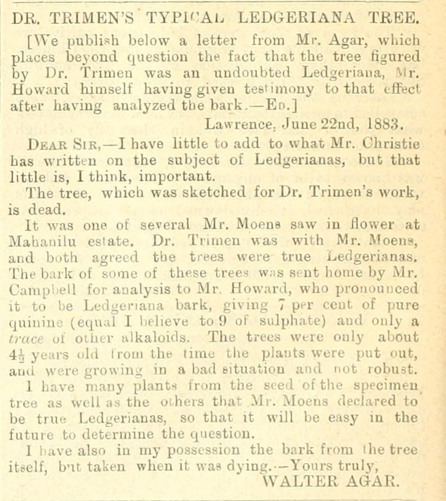

## Three questions

| | The question | The model does | You decide |
|---|---|---|---|
| **Clean** | Is this what the page says? | Flags what reads oddly | Read the page and rule |
| **Structure** | What is a record here? | Proposes fields, fills them, keeps the quotes | What counts; did the meaning change? |
| **Ground** | Who is this? | Retrieves candidates with evidence | Supported, unresolved, or wrong |

. . .

Ten years ago the same three questions took five institutions and a text-mining pipeline, and scored F 0.6.
What changed is who writes the pipeline and how fast the loop runs. What did not change is the right-hand column.

::: notes
Trading Consequences (Clifford et al. 2016): 10.5 million pages, Edinburgh Geoparser, GeoNames, "Italy" in Texas. One sentence, then move on.
:::

## One page

:::: {.columns}
::: {.column width="50%"}
{height="600"}
:::
::: {.column width="50%"}
Walter Agar, *The Tropical Agriculturist*, 2 July 1883, p. 66. 234 words.

Henry Trimen, Director of the Royal Botanic Gardens, Ceylon, had illustrated a cinchona tree. A London quinine maker said it was the wrong species. Planters wrote in.

. . .

You need to know nothing about cinchona.

The page contains one decision of each kind.
:::
::::

## The hour

| Min | | |
|---|---|---|
| 0–5 | The page | Trimen in the Colonial Office List; the letter |
| 5–20 | **Structure** | Model: propose a table, extract records. You: did the meaning change? |
| 20–30 | **Ground** | Model: retrieve candidates. You: supported, unresolved, wrong? |
| 30–45 | **Clean** | Together: the OCR against the page; what the correction becomes |
| 45–55 | Exercise | Three decisions. **jimclifford.ca/trimen-workshop/review/** |
| 55–60 | Your data | |

# Structure

## Model: propose, then extract {.smaller}

> Read these passages. **Propose a small table** for studying the people and activities mentioned. **Show two example records before processing the rest.** Preserve the printed wording and source references. Keep inferred information separate from what the text states. Use local record identifiers and do not add Wikidata identifiers yet.

> Use the agreed fields to process this sample. **Save the code, instructions, and output.** Report failed records and uncertain readings. Do not expand a person's name unless the source provides the expansion; record any outside identification separately.

::: notes
Live on S04 if time allows; saved runs otherwise. Two examples first so the structure is cheap to correct.
:::

## What came back {.smaller}

| Run | Model | Records | Flagged uncertain |
|---|---|---|---|
| A | Claude Sonnet 5.5, as coding agent | 85 | 8 |
| B | Claude Fable 5.1, as coding agent | 71 | 9 |
| C | Qwen3.8-27B, local, inside a script: the model used at scale | 13 | neither damaged sentence |

Run A, the bark that was analysed:

| | |
|---|---|
| printed_text | The bark of some of these trees was sent home by Mr. Campbell for analysis to Mr. Howard, who pronounced it to be Ledgeriana bark … |
| asserted_by | S04-P02 (signed "WALTER AGAR") |
| **inferred_note** | **Which trees supplied the bark is not stated beyond "some of these trees"** |

## You: did the meaning change? {.smaller}

:::: {.columns}
::: {.column width="50%"}
**The editor's headnote:**
the tree figured by Dr. Trimen was an undoubted Ledgeriana, Mr. Howard himself having given testimony to that effect after having analyzed the bark.

**Agar:**
The bark of **some of these trees** was sent home … to Mr. Howard.

I have also in my possession the bark from **the tree itself**.
:::
::: {.column width="50%"}
A record saying *Howard analysed the illustrated tree* asserts a chemical result for a specimen never analysed. The whole quarrel rests on it.

. . .

Runs A and B kept them apart. Run C, the affordable model, wrote that Agar "confirms the tree sketched for Dr. Trimen was an undoubted Ledgeriana". That is the editor's sentence.

**Its output reads well. Would you have noticed?**
:::
::::

# Ground

## Model: retrieve candidates {.smaller}

> Look up candidate identities using the configured Wikidata tools and the Colonial Office List records. **Save the retrieved evidence and lookup date.** Show what supports the match, what conflicts, what is missing. **Leave unresolved cases unresolved. Do not generate QIDs from memory.**

| Printed | Candidate | Supports | Conflicts or missing |
|---|---|---|---|
| "HENRY TRIMEN", Peradeniya | Q2462643, botanist 1843–1896 | Signature, address; CO List: director, Ceylon, 1880 | A brother, Roland, in both collections |
| "WALTER AGAR", Lawrence | none | | Two searches: a politician, a zoologist b. 1882, a temple, a thickening agent |

## You: supported, unresolved, or wrong

1. **Does the identifier resolve to what was retrieved?** A Q-number from a model's memory is not a lookup.
2. **Is that entity the one in this source?** Name, type, dates, place, activity. A real item can be the wrong person.
3. **What does the link assert?** This mention is that man. Not every statement on the item. Not that 1883 "Ceylon" is the modern state.

. . .

Trimen: supported, for these mentions. Agar: unresolved; keep the local record and the searches that were run. "Not found" is not "does not exist".

# Clean

## The OCR {.smaller}

Chandra 2, a vision-language OCR model. Tested on this corpus; good results. On this page:

> … were put out, and were now **in a full condition and in flower**.

> I have by my **prints of the leaves of some of the trees** …

. . .

The page:

> … and were **growing in a bad situation and not robust**.

> I have **many plants from the seed of the specimen tree** …

## OCR is better, and not perfect {.smaller}

The old archive.org text layer, same sentences:

> … ami were growing; in a bad situation and not robust. I have many plants from the seed of the specimen^ tree as well as the oiheis that Mr. Moens declared …

. . .

- The old OCR's errors look like errors. The new OCR's errors read like prose.
- The two frontier runs flagged the sentences, then guessed; every guess was wrong. The affordable model reported the sentence as fact.
- The two OCRs disagree exactly where the new one is wrong.

**A model can tell you a sentence reads oddly. Only the page tells you what it says.**

## What the correction becomes

> This example is wrong for the following reason: [explain]. **Find other records that might have the same problem.** Propose a correction and show which records it would affect. Rerun a small batch and show both corrected cases **and previously accepted cases that changed**.

. . .

- An uncertain reading is not data until someone has looked at the page.
- A model's guess at the wording is not a reading.
- Where two OCRs disagree, send the sentence to a human.
- The probe that found the error becomes a test.

::: notes
If there is time: the Tropical name-evidence fix (initial accepted as full name; 889 "verified" expansions became hypotheses; three probes now tests). Otherwise point to the Further pages.
:::

## Exercise: 45–55 {.smaller}

**jimclifford.ca/trimen-workshop/review/**

| | | |
|---|---|---|
| **Clean** | R3 | Does the OCR reading stand? Open the scan |
| **Structure** | R2 | Did Howard analyse the illustrated tree's bark? |
| **Ground** | R1, R4 | Is "Dr. Trimen" Q2462643? Is there an item for Walter Agar? |
| extra | R5, R6 | A plant name string; two men one letter apart |

Write the reason. The reason is what becomes the rule.
Zoom: **Copy summary for chat**. Room: hands up when asked.

## Your own data {.smaller}

- **One question, one small sample, the page reachable.** Twenty records you can check beat two thousand you cannot.
- **Local identifiers first.** External ones only after retrieval and review. None suitable? Keep the local id.
- **No identifiers from memory.**
- **Model decisions and human decisions in different columns.** Fingerprint the data the decisions were made on.
- **Make the correction a test.**
- **Two kinds of model.** A frontier model writes the pipeline once. A local open model (Qwen on a shared GPU) reads the collection inside it.

## Three questions

| | | You decide |
|---|---|---|
| **Clean** | Is this what the page says? | Read the page and rule |
| **Structure** | What is a record here? | What counts; did the meaning change? |
| **Ground** | Who is this? | Supported, unresolved, or wrong |

**jimclifford.ca/trimen-workshop** — pages, saved outputs, exercise, worked answers, the wider research packet.
