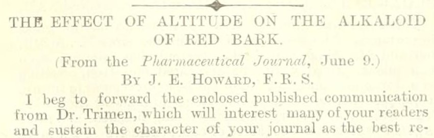
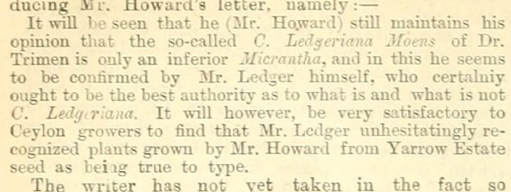

## The question {.smaller}

**Henry Trimen**, Director of the Royal Botanic Gardens, Peradeniya, Ceylon, from 1880.

In the *Colonial Office List* every year, 1883–1896.
In *The Tropical Agriculturist*, a Colombo planters' monthly, hundreds of times.

. . .

> Who is Trimen connected to in *The Tropical Agriculturist*, and what evidence supports those connections?

. . .

In 1883 the journal ran a public quarrel between Trimen and the London quinine maker John Eliot Howard over one cinchona tree. Planters, seed, gardens, bark samples, chemical analyses. People, things and actions, with sources.

::: notes
Open with the Imperial Careers atlas view prepared in advance (under two minutes), then this slide. The question is the whole hour; everything else is method.
:::

## Ten years ago {.smaller}

*Trading Consequences*, 2012–13: 10.5 million scanned pages, 7 billion tokens. Historians, computational linguists, a database team, a visualisation team, five institutions.

| | 2013 |
|---|---|
| **Cleaning** | "lime" read as "time" and "line"; long-s "salt" as "fait"; trade tables collapsed into 210-word "sentences". 14.9% of gold-standard locations had OCR errors |
| **Structuring** | Six-stage pipeline adapted from the Edinburgh Geoparser; relation = same sentence; commodity lexicon bootstrapped from customs records and Wikipedia |
| **Grounding** | GeoNames string matching: "Saharunpore" not found, every "Italy" placed in a Texan town. F-scores 0.62 / 0.61 |
| **Review** | Errors seen in the visualisations got fixed. Missed entities were invisible |

::: {.fragment}
Clifford, Alex, Coates, Klein and Watson, *Historical Methods* 49:3 (2016).
:::

::: notes
Same three problems. What changed is who writes the pipeline and how fast the error-to-fix loop runs. What did not change is where judgment is needed.
:::

## What changed, what did not

:::: {.columns}
::: {.column width="50%"}
**Changed**

- The agent writes the pipeline
- Semantic search instead of a string gazetteer
- Models read in context: "grease the machine" is not a commodity
- The loop from error to fix runs in minutes
:::
::: {.column width="50%"}
**Did not change**

- OCR lies, and only the page settles it
- People absent from every authority file
- Plausible wrong matches
- A corrected error has to become a rule
- Errors you cannot see need a sample
:::
::::

## The hour

| Min | | |
|---|---|---|
| 0–5 | The question | Trimen in the Colonial Office List |
| 5–20 | **Structure** | The model proposes a table, extracts records, saves a script |
| 20–30 | **Ground** | Wikidata and Colonial Office List lookups; a review view |
| 30–45 | **Clean and check** | A consequential error, found together; a revision directed |
| 45–55 | Exercise | Six decisions, in the room and on Zoom |
| 55–60 | Your own data | |

Everything is saved. If a live step stalls, we switch to the checkpoint.

**jimclifford.ca/trimen-workshop** — same pages and exercise for everyone.

# 1. The question

## Trimen in the Colonial Office List {.smaller}

> TRIMEN, HENRY, M.B. (Lond.), F.R.S., F.L.S. —Formerly lecturer on botany at St. Mary's Hospital, London, 1867 to 1875; was senior assistant to department of botany, British Museum, 1869 to 1879; director Royal Botanical Gardens, Ceylon, Feb., 1880; author of numerous works and papers on pure and applied botany. *(1889 edition)*

The Imperial Careers graph (`kgp_col1889-p554b20`, seven editions):

| Position | Place | Years |
|---|---|---|
| lecturer on botany | London | 1867–1875 |
| senior assistant, department of botany | British Museum | 1869–1879 |
| director, Royal Botanical Gardens | Ceylon | 1880– |

A name, posts, dates, a stable identity across editions. Nothing about what he did or with whom.

## The Wars of the Quinologists, 1883 {.smaller}

| | Item | |
|---|---|---|
| S02 | "The Wars of the Quinologists", July, pp. 27–28 | The editor frames the dispute |
| S03 | "Dr. Trimen's Ledgeriana: Mr. T. N. Christie to the Rescue", p. 37 | A planter traces the tree's seed |
| **S04** | **"Dr. Trimen's Typical Ledgeriana Tree", p. 66** | **Walter Agar, 234 words. The exercise** |
| S05–06 | Trimen's reply, December, pp. 453–455 | The competing identifications |
| S01 | Howard on "C. pubescens How.", July 1881 | A rejected name |

Seventy-two articles mention both Trimen and Howard. That is a discovery set, not 72 relationships.

## The passage {.smaller}

:::: {.columns}
::: {.column width="55%"}
{height="560"}
:::
::: {.column width="45%"}
*[We publish below a letter from Mr. Agar, which places beyond question the fact that the tree figured by Dr. Trimen was an undoubted Ledgeriana, **Mr. Howard himself having given testimony to that effect after having analyzed the bark**.—Ed.]*

. . .

"The bark of **some of these trees** was sent home by Mr. Campbell for analysis to Mr. Howard …"

"I have also in my possession the bark from **the tree itself** …"
:::
::::

::: notes
Do not point out the discrepancy yet. Let the room read it. The editor says one thing; Agar says another. We come back to it at minute 30.
:::

# 2. Structure

## Prompt: propose a structure

> Read these Tropical Agriculturist passages. Propose a small table for studying the people and activities mentioned. **Show two example records before processing the rest.** Preserve the printed wording and source references. **Keep inferred information separate from what the text states.** Use local record identifiers and do not add Wikidata identifiers yet.

::: notes
Live: run this on S04 and S03. Two examples first, so the structure is cheap to correct. If it runs past minute 12, switch to the saved run.
:::

## Prompt: build and run the extraction

> Use the agreed fields to process this sample. **Save the code, instructions, and output** so we can inspect and rerun the work. **Report failed records and uncertain readings.** Do not expand a person's name unless the source provides the expansion; record any outside identification separately.

::: notes
What the prompt asks for beyond records: saved code, reported failures, and a wall between what the source prints and what the model knows.
:::

## What came back {.smaller}

Two cold runs, 6 October, different models, nothing edited.

| Run | Model | Records | Failed | Uncertain |
|---|---|---|---|---|
| A | Claude Sonnet 5.5 | 85 | 0 | 8 |
| B | Claude Fable 5.1 | 71 | 1 | 9 |

Run A, the bark that was analysed:

| | |
|---|---|
| printed_text | The bark of some of these trees was sent home by Mr. Campbell for analysis to Mr. Howard, who pronounced it to be Ledgeriana bark … |
| asserted_by | S04-P02 (signed "WALTER AGAR") |
| **inferred_note** | **Which trees supplied the bark is not stated beyond "some of these trees"; whether it includes S04-T01 [the sketched tree] is not said.** |

::: notes
That last field is the whole dispute. Both runs kept the editor's claim apart from Agar's. The question for the room later: would you have noticed if they had not?
:::

## Three things to inspect

1. **Omissions.** Is everyone and everything in the table? Both runs made the editor a person record. Right: the editor makes claims.
2. **Invented details.** A given name the text does not print? A relative date made absolute without saying so? Run B filled "outside identification" for six people from memory, each marked UNVERIFIED.
3. **Changed meaning.** Did a careful statement become a flat one?

. . .

And one thing neither run could do: two sentences of the OCR are damaged. Both said so. Both guessed. Every guess was wrong.

# 3. Ground

## Three questions, kept separate

1. **Does the identifier resolve to the retrieved entity?**
   We show only QIDs we fetched. A Q-number from a model's memory is not a lookup.

2. **Is that entity the one in this source?**
   Name, type, dates, place, activity. A real item can be the wrong person.

3. **What does the connection assert?**
   This mention refers to that man. Not that every statement on the item is true. Not that 1883 "Ceylon" is the modern state.

## Prompt: retrieve candidates

> Look up candidate identities for these people using the configured Wikidata tools and the supplied Colonial Office List records. **Save the retrieved evidence and lookup date.** For each candidate, show what supports the match, what conflicts, and what is missing. **Leave unresolved cases unresolved. Do not generate QIDs from memory.**

Semantic search (WikidataMCP), then statement reading. Not the string search: "Walpole Island" returns an island in New Caledonia.

## Candidates {.smaller}

| Printed | Candidate | Supports | Conflicts or missing |
|---|---|---|---|
| "HENRY TRIMEN", Peradeniya | Q2462643, botanist 1843–1896 | Signature; address; CO List career | Brother Roland in both collections |
| "JOHN ELIOT HOWARD" | Q3181423, chemist 1807–1883 | Full signature 1881 | Dies November 1883, mid-dispute |
| "Mr. Moens" | Q21340893, botanist 1837–1886 | Java cinchona context | Surname only |
| "WALTER AGAR", Lawrence | none | | Two searches: a politician, a zoologist b. 1882, a temple, a thickening agent |
| "THOS. NORTH CHRISTIE" | none | | Not the "Mr. T. Christy" he criticises |

"Not found" is a recorded search with a date, not a proof of absence.

# 4. Review

## The editor versus the letter {.smaller}

:::: {.columns}
::: {.column width="50%"}
**Editor:** the tree figured by Dr. Trimen was an undoubted Ledgeriana, Mr. Howard himself having given testimony to that effect after having analyzed the bark.

**Agar:** The bark of **some of these trees** was sent home by Mr. Campbell for analysis to Mr. Howard …

**Agar:** I have also in my possession the bark from **the tree itself**, but taken when it was dying.
:::
::: {.column width="50%"}
If the illustrated tree and the analysed bark become one thing, the dataset asserts a chemical result for a specimen that was never analysed.

The whole dispute, whether *that* tree was a Ledgeriana, would rest on it.

. . .

A model following the editor makes this error. Neither rehearsal run did.

**Would you have noticed if it had?**
:::
::::

## The reading {.smaller}

OCR, as delivered:

> The trees were only about 4½ years old from the time the plants were put out, and were now **in a full condition and in flower**.

> I have by my **prints of the leaves** of some of the trees as well as the other that Mr. Moens had sent to be true Ledgerianas …

. . .

The page:

> … and were **growing in a bad situation and not robust**.

> I have **many plants from the seed of the specimen tree** as well as the others that Mr. Moens declared to be true Ledgerianas …

. . .

Both runs flagged these. Run A guessed "in full bloom". Run B guessed "the others that Moens had said". A model can detect damaged OCR. It cannot repair it from the text.

## Exercise: 45–55 {.smaller}

**jimclifford.ca/trimen-workshop/review/**

| | Decision | |
|---|---|---|
| R1 | Is "Dr. Trimen" Q2462643? | What support looks like |
| R2 | Did Howard analyse the illustrated tree's bark? | The editor versus the letter |
| R3 | Does the OCR reading stand? | Text versus page |
| R4 | A Wikidata item for Walter Agar? | What "not found" means |
| R5 | Is "C. pubescens How." Q164574? | A name string versus what the source says about it |
| R6 | Are "T. Christy" and "Thos. North Christie" one person? | Spelling distance versus the text |

Do at least R1–R3. Write the reason; the reason becomes the rule.
Zoom: use **Copy summary for chat**. Room: hands up when asked.

# 5. Revise

## From a decision to a rule

> This example is wrong for the following historical reason: [explain]. **Find other records that might have the same problem.** Propose a correction and show which records it would affect. After we review the change, rerun a small batch and show both corrected cases **and previously accepted cases that changed**.

## A safeguard that validated invented names {.smaller}

Tropical's profile builder checked that a model-supplied given name was "printed in the article". It accepted an initial as proof of a full name.

| Proposed | Source text | Before (v1) | After (v2) |
|---|---|---|---|
| James Watt | Mr. J. Watt writes about tea. | printed | `initials` |
| Henry Trimen | Mr. H. Trimen writes about tea. | printed | `initials` |
| John Smith | Mr. John Smithson writes about tea. | printed | `none` |
| Henry Trimen | … HENRY TRIMEN. Royal Botanic Gardens | printed | `full` |

Across the corpus: 889 "verified" expansions became hypotheses. The three probes are now tests.

The historian's reason: a model that knows who "F. von Mueller" is has added outside knowledge to the record.

## A mixed profile is not one person {.smaller}

The merge said a MIXED verdict leaves the identifier empty. A fallback filled it from the Colonial Office List anyway.

Two profiles the model had explicitly called *two people* left the pipeline with one identifier each, "high" confidence.

. . .

Fix: one identity gate. MIXED asserts nothing and is flagged for splitting. NONE and UNSURE keep the identifier as a *candidate*. Tests name both cases.

A valid identifier does not make a mixed profile valid.

## After a revision, check three things

1. The cases the change was meant to fix.
2. The previously accepted cases that changed. In the Tropical rebuild this was the larger group.
3. Whether the rule is now a test.

A model can do all three. Deciding the original was wrong, and why, was the historian's work.

# 6. Connect

## Trimen across three collections {.smaller}

| Collection | Holds | Link made by |
|---|---|---|
| Colonial Office List graph | Three career events, seven editions | Built from the List |
| Tropical Agriculturist profiles | P000001: 863 records, 779 articles, 1881–1944 | Rules: name, dates, occupation words |
| Wikidata | Q2462643, 1843–1896 | Retrieved and read |
| This packet | Four attributed claims; 24 catalogued letters | Read from the passages |

. . .

- The links are **automated**. No human decision recorded.
- Agreement is **not independence**: the CO List graph carries Wikidata links the Tropical matcher can inherit.
- 863 is **not an occurrence count**. 1944 is a retrospective article.

## The Trimens who never existed {.smaller}

:::: {.columns}
::: {.column width="50%"}
OCR: *"BY J. L. TRIMEN, F.R.S."*

:::
::: {.column width="50%"}
OCR: *"confirmed by Mr. L. J. L. Trimen, who certainly ought to be the best authority …"*

:::
::::

Two profiles, two records each. The pipeline rightly did not merge them into Henry. It could not know they were not people. Rare, odd name forms: look at the page before you count or link them.

# 7. Your own data

## Rules that saved the research projects trouble {.smaller}

- **Local identifiers first.** External ones only after retrieval and review. No suitable item? Keep the local id.
- **No identifiers from memory.** Anything not retrieved by a tool is unverified.
- **Separate structuring from grounding, and both from modern classification.** An 1883 plant name is a historical usage; what Kew calls it today is another record.
- **Model decisions and human decisions in different columns.** Fingerprint the data the decisions were made on.
- **Make the correction a test.**
- **Report what the sample supports.** Handpicked cases explain failure modes. They are not an accuracy rate.

## What to take away

Describe a small extraction task to a model, and inspect what comes back against the source.

Tell a *candidate* identity from a *supported* match, and say what evidence made the difference.

Turn one correction into a rule, a check or a review step for the rest of the collection.

. . .

**jimclifford.ca/trimen-workshop** — pages, saved outputs, the exercise, worked answers, a guide for your own data. Source and code on GitHub.

::: notes
Questions. Chat monitor reads out the Zoom summaries on R2 and R3.
:::
