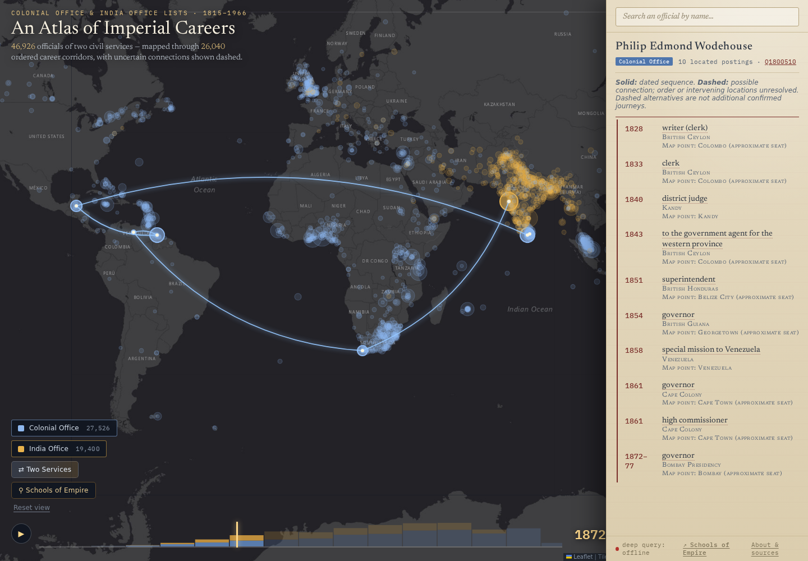

## {#mobility-video .video-slide background-color="#15161a"}

```{=html}
<video data-autoplay controls muted playsinline preload="metadata"
       poster="images/combined-mobility-frame.jpg"
       aria-label="Animated atlas of imperial career postings">
  <source src="https://jimclifford.ca/col_matching/combined_mobility.mp4" type="video/mp4">
  <source src="media/combined-mobility.webm" type="video/webm">
  Your browser cannot play this video. Use the direct link below.
</video>
<p class="video-link"><a href="https://jimclifford.ca/col_matching/combined_mobility.mp4" target="_blank" rel="noopener">Open the video directly</a> · Earlier atlas export</p>
```

::: notes
0–1. Let the 56-second video run. It is an earlier export; the dated build counts in the deck supersede its caption. These are sequences of recorded postings, not observed travel routes. The video starts muted when this slide opens; use Play or Replay in its controls if needed. The direct link opens the MP4 separately. Use the downloaded copy if the network fails.
:::

## What one arc needs {.smaller}

> WODEHOUSE, SIR PHILIP E.—Entered the Ceylon civil service as a writer, May, 1828; … superintendent of Honduras, 1851; … governor of British Guiana; … in 1861 was appointed governor of the Cape of Good Hope.

| Printed wording | Event | Historical place | Plotting seat | Year |
|---|---|---|---|---|
| writer, May, 1828 | writer | British Ceylon | Colombo | 1828 |
| superintendent of Honduras | superintendent | British Honduras | Belize | 1851 |
| governor of British Guiana | governor | British Guiana | Georgetown | 1854 |
| governor of the Cape of Good Hope | governor | Cape Colony | Cape Town | 1861 |
| governor of Bombay (India Office List) | governor | Bombay Presidency | Bombay | 1872–77 |

```{=html}
<div class="flow">
  <div class="node"><b>Printed clause</b><span>“governor of the Cape of Good Hope”</span></div>
  <div class="arrow">→</div>
  <div class="node"><b>Event</b><span>governor · 1861</span></div>
  <div class="arrow">→</div>
  <div class="node blue"><b>Checked place identifier</b><span>Cape Colony, a Wikidata item</span></div>
  <div class="arrow">→</div>
  <div class="node blue"><b>Plotting seat</b><span>Cape Town: a proxy, not a residence</span></div>
  <div class="arrow">→</div>
  <div class="node"><b>Arc</b><span>British Guiana → Cape</span></div>
</div>
```

::: notes
1–3. Source is the 1867 Colonial Office List; Bombay comes from the India Office List. The full table, identifiers and trace are on step 1. “Honduras” to “British Honduras” is an interpretation, kept separately from printed wording. A capital is a plotting proxy, not evidence of residence. Wodehouse is a checked example of the cross-service match; the other bridges need review.
:::

## One career across two Lists {#cross-service-career}

:::: {.columns}
::: {.column width="42%"}
[Colonial Office List]{.blue}\
Ceylon → Honduras → British Guiana → Cape

[India Office List]{.gold}\
Bombay, 1872–77

Linking the entries follows one career across two administrative collections.

**What becomes visible when we read the two Lists together?**

[Open Wodehouse’s career](https://jimclifford.ca/col_matching/?p=kgp_col1878-p447b3)
:::
::: {.column width="58%"}
{fig-alt="Current atlas view of Philip Wodehouse's career, with arcs from Ceylon to Honduras, British Guiana, the Cape and Bombay, and a dated list of postings"}

[Current public atlas, after the 7–8 October repairs]{.caption}
:::
::::

::: notes
3–4. Lead with the historical use: a reader of either List alone sees part of this career. The checked link brings those parts together. This is a selection of postings, not the full itinerary. The public example reflects the repairs published and checked on 7–8 October. The supporting page retains the earlier Wodehouse errors and their corrections as optional teaching material. This one checked link does not establish that all proposed cross-service links are correct.
:::

## What the records make visible {.smaller}

```{=html}
<div class="stats">
  <div class="stat"><span class="num">46,926</span><span class="lbl">person records across two Lists</span></div>
  <div class="stat"><span class="num">305,164</span><span class="lbl">career events</span></div>
  <div class="stat"><span class="num">211,581</span><span class="lbl">events linked to a Wikidata place</span></div>
  <div class="stat"><span class="num">36,431</span><span class="lbl">arcs for 16,287 roster records with moves (September build)</span></div>
</div>
```

- Administrative accounts of careers, offices and honours.
- Person counts resolved within each List; their sum includes cross-service overlap.
- Seats used for plotting; arcs connect postings, not observed journeys.

**Whose careers does this source make easy to see? Whose does it leave out?**

::: notes
4–5. Ask for one response, room or chat. Official records make the administration's categories visible, not everyone who worked for or lived under it. Grounding covers 1,066 of 27,526 CO people, about 3.9%; person links are selective, not representative. Event-to-place coverage is a different measure. Stats copied from 4 September.
:::

## Three questions

| | The question | You decide |
|---|---|---|
| [Structure]{.gold} | What is a record here? | What counts as an event |
| [Clean]{.gold} | One person or two? | Merge, keep apart, review |
| [Ground]{.gold} | Which place, which person? | Supported, unresolved, wrong |

```{=html}
<div class="flow">
  <div class="node blue"><b>OCR text</b><span>85 volumes</span></div>
  <div class="arrow">→</div>
  <div class="node"><b>Structure</b><span>entries → events</span></div>
  <div class="arrow">→</div>
  <div class="node"><b>Clean</b><span>editions → people</span></div>
  <div class="arrow">→</div>
  <div class="node"><b>Ground</b><span>names → identifiers</span></div>
  <div class="arrow">→</div>
  <div class="node blue"><b>Graph and atlas</b><span>visualise, then look</span></div>
</div>
<div class="loopback">↺ See · Fix the rule · Rerun for every affected record</div>
```

::: notes
5–7. A historian owns the decisions; the agent writes scripts that apply them at scale. Today participants mark up an entry and make three decisions. We start after OCR. The published description mentions Britannica OCR tools; this session uses existing olmOCR output and does not demonstrate those tools. Your own dataset is the take-home application. Put the site and exercise links in Zoom chat.
:::

## The source

> BALMER, F. E.—Dep. chief acctnt., G.P.O., E. Africa Prot., Mar., 1919; ch. acctnt., G.P.O., Kenya, Oct., 1919; ch. acctnt., Kenya-Uganda-Tanganyika post and tel. service, 1933; senr. dep. P.M.G., <mark>do.</mark>, 1935.

85 volumes OCR’d, **1867–1966**. The Record of Services appears from **1883**. The same person returns in many editions.

::: {.defs}
::: {.def}
[What is OCR?]{.def-term}
Optical character recognition turns a page image into text. These volumes were read by olmOCR, an open model that returns text blocks with their position on the page. OCR errors and printers’ errors look alike in the text; the scan decides.
:::
::: {.def}
[What is “do.”?]{.def-term}
*Ditto*: “the same as before”. The printer saved space by pointing back to an earlier place or office. A reader resolves it without thinking; a program has to be told.
:::
:::

::: notes
7–8. Keep OCR and source separate. A surprising date may be an OCR error or a printed error. Each record needs a volume and page reference; the packet's source notes are not scans. The 1946 restart lacks the usual Record of Services.
:::

## Mark up Balmer

:::: {.columns}
::: {.column width="70%"}
Choose **entry 2**. Tag the last two positions, their places and years.

Three minutes, then compare:

**What does “do.” inherit?**\
**Where should that decision be recorded?**
:::
::: {.column width="30%"}
{width="240" fig-alt="QR code for the mark-up exercise"}
:::
::::

**jimclifford.ca/imperial-careers-workshop/annotate/**

::: notes
8–13. Three minutes marking, one minute comparing, one minute debrief. Ask one room participant and the chat monitor for a reason. Paper users circle the corresponding words. Protect this time. The remaining entries are take-home practice.
:::

## Start with the raw OCR

I showed **Claude Code** the text and discussed how to structure it.

> ch. acctnt., Kenya-Uganda-Tanganyika post and tel. service, 1933; senr. dep. P.M.G., do., 1935.

:::: {.columns}
::: {.column width="52%"}
**Could Python do this on its own? What would the rules need to know?**

[Read a sample together. Agree what counts as a record and what fields to keep.]{.small}

```{=html}
<div class="source-meta"><b>edition</b> 1936 · <b>printed page</b> 614<br><b>OCR page index</b> 832 · <b>block</b> 11<br><b>bbox</b> [142, 2184, 827, 2334] · <b>category</b> text</div>
```
[[Balmer’s original OCR block](outputs/structure/balmer-raw-ocr.json): every record keeps its way back to the page]{.caption}
:::
::: {.column width="48%"}
::: {.def}
[What is Claude Code?]{.def-term}
Anthropic’s coding agent. It runs on your own computer, reads the files you point it to, and writes and runs Python with your permission. You describe the task in plain language and judge the results; it reports what it did.

It is a commercial service, paid through a Claude subscription or per use. Here it **built** the pipeline; it did not read the 65,000 entries.
:::
:::
::::

::: notes
13–14. Start with the actual working process: I opened the raw OCR with Claude Code and discussed whether a Python parser could do the job. The displayed excerpt is copied directly from the 1936 raw OCR block, before abbreviation expansion. The saved file includes the original bounding box, OCR page index 832, block index 11 and printed page 614. This is a walkthrough of the process, not a recovered chat transcript. Use the Balmer exercise they just completed: they already know that “do.” refers back to a place. Ask what the code would need to preserve to reach the same reading. Claude Code helped inspect the source, discuss the approach and write the scripts; the historian decided what the fields meant.
:::

## Too irregular for regular expressions alone {.smaller}

**A familiar historical problem: semi-structured data.**

The fields recur. The wording and relationships vary.

| Source wording | What needs interpretation |
|---|---|
| “do., 1935” | Which preceding place does this posting inherit? |
| “B. Honduras, Apl., 1898” | An appointment date; “B.” belongs to the place name |
| Trimen’s posts, 1867–1875 and 1869–1879 | Two concurrent jobs, not one sequence |

Finding a year is easier than deciding **what it dates**.

::: {.def}
[What is a regular expression?]{.def-term}
A pattern that matches text by its shape. `1[89]\d\d` finds every year from 1800 to 1999 in an entry. It cannot say which posting the year belongs to, or that “do.” points back three clauses.
:::

::: notes
14–15. This is a source problem historians know well: recurring headings, names, dates and offices without a uniform sentence structure. OCR can add variation, but even perfectly transcribed entries contain elision, abbreviations, compound clauses and concurrent appointments. Regular expressions recognise specified patterns; increasingly elaborate rules did not cover the collection reliably. Python is still useful for segmentation, regular cases and checks. Explain the three rows: Balmer inherits the preceding service’s place; Blakely’s “B. Honduras” is British Honduras and April 1898 dates his clerkship; Trimen’s lecturer and British Museum posts overlap. The third example is in the saved Trimen source pack. The conclusion of our discussion was that Python rules alone were insufficient for this corpus. The hard part is binding the right position, place and date, not simply detecting a number.
:::

## Develop the hybrid with Claude Code

[Agree the fields → try examples → decide which work belongs in each stage.]{.small}

```{=html}
<div class="flow">
  <div class="node blue"><b>1 · Python</b><span>Parse the regular entries. If any dated clause fails, refuse the whole entry.</span></div>
  <div class="arrow">→</div>
  <div class="node wide"><b>2 · Qwen reads</b><span>One entry in, one JSON record out. Binds position, place and dates across ditto, elided and concurrent clauses.</span></div>
  <div class="arrow">→</div>
  <div class="node blue"><b>3 · Python checks</b><span>Drop any place or year not in the source. Apply logged fixes for recurring errors.</span></div>
</div>
```

::: {.def}
[What is Qwen?]{.def-term}
A family of **open-weight** language models from Alibaba’s Qwen team. Open weight means the trained model can be downloaded and run on your own hardware, or reached through a hosted service. The structuring runs used **Qwen3.6-35B-A3B**: 35 billion parameters in all, about 3 billion active for each word-piece, so one GPU can run it quickly.
:::

**Claude Code helped build the pipeline. Qwen read the entries.**

::: notes
15–16. Walk through the design as a division of work developed with Claude Code. First, keep Python where explicit rules are reliable; if a dated clause cannot be parsed, refuse the whole entry rather than silently omit it. Second, ask the model to interpret the difficult clauses within an agreed schema. Third, use Python to validate the result and log recurring corrections. One event has position, place, start/end years and an inheritance flag. Compare sample outputs with the OCR before increasing the run size. Claude Code was the interactive coding environment; Qwen3.6-35B was the model called by the corpus-reading script. The saved in-session runbook records how the reference examples were structured and validated.
:::

## Three ways to run Qwen

The script sends each entry to a web address that speaks the OpenAI request format.\
**Change one address to change where the model runs.**

```{=html}
<div class="cards">
  <div class="card">
    <span class="kicker">Hosted service</span>
    <h4>OpenRouter</h4>
    <p>A broker for many models, open and commercial. Pay per token; no hardware.</p>
    <p class="fact">Used in June to compare several open models on the same 40 entries, scored against records Claude had structured in-session. Qwen3.6 came closest.</p>
  </div>
  <div class="card accent">
    <span class="kicker">Desktop GPU</span>
    <h4>NVIDIA DGX Spark</h4>
    <p>A desktop machine with 128 GB of memory shared with its GPU. vLLM serves the model on the local network.</p>
    <p class="fact">India Office List: 30,496 entries in 8.24 hours overnight. No per-request bill.</p>
  </div>
  <div class="card">
    <span class="kicker">Research cluster</span>
    <h4>Alliance: Narval, Nibi</h4>
    <p>Canada’s national research computing. Submit a batch job; it waits in a queue, starts the model, works through a file.</p>
    <p class="fact">Qwen3.8-27B judged 3,539 identity pairs in 35 minutes on one A100 GPU.</p>
  </div>
</div>
```

::: {.def}
[What is vLLM?]{.def-term}
Open-source software that loads a model onto a GPU and answers requests in the same format as the commercial services, so the same script works locally, on a cluster or through OpenRouter.
:::

::: notes
16–17. One slide on infrastructure, because participants ask how to run the model. The script did not change between routes: it posts the system prompt and one entry to an OpenAI-compatible endpoint, and the base URL selects the service. The June bake-off (19 June, 40 entries against the in-session Opus reference set, reasoning off, temperature zero) ran several open models through OpenRouter; Qwen3.6-35B-A3B had the best event precision, place and honours scores. That reference set is provisional, not a gold standard. Production ran the same model on a DGX Spark desktop through vLLM, with no tunnel to depend on. The cluster example is later identity work, not structuring: Narval job 2430423, Qwen3.8-27B, one A100-40GB, 1.7 pairs a second. Cluster compute nodes have no internet, so the job serves the model inside the allocation. Any change of model or serving setup needs the sample audit again.
:::

## The prompt is the decisions

> Extract ONLY what is printed; never invent or infer facts.

> **events:** one object per distinct posting. EXPLODE compound clauses.

**Place rule, summarised:** keep printed wording; flag inheritance and stop at a stated transfer.

> **birth_year:** only if printed. NEVER infer from the earliest career date.

::: {.def}
[What is a system prompt?]{.def-term}
The standing instructions sent with every one of the 65,000 entries. The entry itself follows as the user message. Every rule here exists because an earlier run broke it.
:::

::: notes
17–19. This is what the discussion became: explicit instructions for the model inside the pipeline. The first, second and fourth quotations are from the saved prompt; the place line summarises its inheritance rule, including the stop at a stated transfer. Link to the exact prompt on step 3. Ask: would “defeated in an election” count as an office held? Leave that distinction in mind for Brewster.
:::

## Read records against the source

[Examples from the saved extraction audit, before rule fixes]{.small}

| Source | Earlier output | Reading to preserve |
|---|---|---|
| “do., 1935” | place: “do.” | Inherit the preceding place |
| “Apl., 1898” | birth_year: 1898 | Date of the appointment |
| “KT. BACH. (1920)” | two honours | One knighthood |

```{=html}
<div class="flow">
  <div class="node blue"><b>Sample</b><span>every tenth record, then spread across the corpus</span></div>
  <div class="arrow">→</div>
  <div class="node"><b>Read against the source</b><span>record beside the printed entry</span></div>
  <div class="arrow">→</div>
  <div class="node"><b>Sort findings</b><span>one-off, or a recurring pattern?</span></div>
  <div class="arrow">→</div>
  <div class="node after"><b>Logged rule</b><span>or individual review</span></div>
</div>
```

**Batch run: 30,496 entries in 8.24 hours.**

::: notes
19–20. The model’s output still needs to be read against the source. These are historical extraction outputs used to teach that reading, not a report of current defects. All three audits were read by a model; the displayed examples were checked by hand. The detailed sample counts remain on step 3 for questions; they do not measure finished-graph accuracy. Ask participants to explain one reading before moving to the Balmer replay. Some findings need individual review rather than a general rule. The resulting hybrid processed 30,496 India Office entries in 8.24 hours, 25–26 June, with 16 workers, reasoning off and temperature zero. Put this scale result after the design and review process. If asked: 55 entries failed JSON validation, a format count rather than a count of inaccurate records.
:::

## Replay a past correction

**Balmer’s final event · saved extraction output**

```{=html}
<div class="flow">
  <div class="node before"><b>Before</b><span>place: “do.”<br>place_inherited: true</span></div>
  <div class="arrow">→</div>
  <div class="node wide"><b>Rule</b><span>A literal ditto, and the previous event has a resolved place → inherit that place and log the reason</span></div>
  <div class="arrow">→</div>
  <div class="node after"><b>After</b><span>place: “Kenya-Uganda-Tanganyika”<br>place_inherited: true</span></div>
</div>
```

**3 saved records · 12 events · 1 place corrected**

- Other events and fields unchanged.
- Second run changes nothing.
- No preceding resolved place? Leave it for review.

[Saved before-and-after records](outputs/structure/ditto-fix-replay.json)

::: notes
20–23. Use the saved replay; run python3 scripts/demo_ditto_fix.py only if time allows. No model or network is needed. Introduce this as a replay of an earlier correction using saved records. It is not a rerun of col_matching. The other eleven events and the saved Blakely and Connolly fields are unchanged: this demonstrates the scope of the ditto rule. The missing-predecessor checks are constructed tests, not historical records. Ask what else must be checked before applying this to the corpus: affected records, boundary cases, a fresh sample afterwards.
:::

## Clean: forty editions, one person

A missed link leaves a fragmented career.\
A false merge can silently corrupt later analysis.

[Ties resolve to no merge.]{.gold}

```{=html}
<div class="flow">
  <div class="node blue"><b>199,099</b><span>printed entries, Colonial Office List</span></div>
  <div class="arrow">→</div>
  <div class="node"><b>Strong rules</b><span>same name and birth year, or a shared dated event</span></div>
  <div class="arrow">→</div>
  <div class="node"><b>Clusters</b><span>same forename, same surname ending, so OCR variants meet</span></div>
  <div class="arrow">→</div>
  <div class="node"><b>Dossiers</b><span>a model argues each hard case; review queue for the rest</span></div>
  <div class="arrow">→</div>
  <div class="node after"><b>27,526</b><span>person records, with a ledger of reasons</span></div>
</div>
```

::: {.defs}
::: {.def}
[Dossier]{.def-term}
Every version of every biography in a cluster, laid out for one decision: births, schools, honours, the full dated career.
:::
::: {.def}
[Ledger]{.def-term}
An append-only file of merge decisions, each with its reason, so any one can be revisited and reversed.
:::
:::

::: notes
23–25. 199,099 printed CO entry instances resolved into 27,526 person records. The ledger makes decisions revisitable; do not call false merges irreversible. Explain a dossier as the source evidence for both candidates, gathered in one place.
:::

## Decide before the answer

```{=html}
<div class="cards" style="font-size:0.78em">
  <div class="card"><span class="kicker">One edition</span><h4>ABERY, Joseph</h4><p>M.B.C.M.</p><p>1867 · Ceylon · assistant colonial surgeon</p></div>
  <div class="card"><span class="kicker">Six editions</span><h4>CARBERY, Joseph</h4><p>M.B.C.M.</p><p>1867 · Ceylon · assistant colonial surgeon</p></div>
</div>
```

**Merge, keep apart, or review? What evidence decides it?**

::: {.fragment}
The ledger merges them: consistent name and qualification, an identical dated appointment, and a plausible OCR loss. Preserve both entries and the reason.
:::

::: notes
25–28. Give 30 seconds to decide; room and Zoom use the same three words. Then reveal. Qualification is not an honour. Checking the scan for the lost letters would strengthen the decision. A common first name alone is insufficient.
:::

## Keep apart; keep the evidence

```{=html}
<div class="cards" style="font-size:0.78em">
  <div class="card"><span class="kicker">Born 1836</span><h4>A’BECKETT, Thomas</h4><p>Lincoln’s Inn</p><p>Victorian judge · knighted 1909</p></div>
  <div class="card"><span class="kicker">Born 1898</span><h4>BECKETT, Thomas Rumbold</h4><p>Judd School</p><p>Nigerian telegraph engineer</p></div>
</div>
```

Different schools and careers, not only different birth years. **Keep apart.**

::: {.def}
[The merge rules, in brief]{.def-term}
Merge only on positive evidence: an overlapping dated event, a shared honour with its year, near-identical education, or an OCR variant with a consistent career. Birth year alone never splits: it is often misread. Different spelled forenames keep people apart.
:::

::: notes
28–30. A birth-year discrepancy alone is not a universal veto: it may be OCR. Here the whole dossiers differ. The supporting page has more clusters; do not run all four aloud.
:::

## Ground: retrieve, read, decide

Every plotted posting needs a place.\
Every shared person identifier asserts an identity.

```{=html}
<div class="flow">
  <div class="node blue"><b>Mention</b><span>“Victoria, 1912”</span></div>
  <div class="arrow">→</div>
  <div class="node"><b>Retrieve</b><span>candidate items from a search tool</span></div>
  <div class="arrow">→</div>
  <div class="node"><b>Read</b><span>type, dates, location against the career</span></div>
  <div class="arrow">→</div>
  <div class="node after"><b>Decide and record</b><span>supported · unresolved · wrong, with evidence and date</span></div>
</div>
```

No supported match? Keep the local identifier.

::: {.defs}
::: {.def}
[What is Wikidata? A QID?]{.def-term}
A free, shared knowledge base. Each item has an identifier: Q plus a number. Q1800510 is Philip Wodehouse. Linking to it lets other projects join their data to ours.
:::
::: {.def}
[What is MCP?]{.def-term}
Model Context Protocol: a standard way to hand a model a tool, such as a Wikidata search. The answer comes back as retrieved evidence, not from the model’s memory.
:::
:::

::: notes
30–31. An identifier's existence is not evidence that it belongs to this mention. Introduce MCP simply as a lookup tool the agent can use; the protocol is not today's lesson.
:::

## Live: three searches

1. **Henry Trimen** — botanist, Ceylon, Peradeniya.
2. **Ferdinando Hamlyn Price** — a rare name, compatible dates, thin career evidence.
3. **Elwood D’Arcy Tibbits** — no plausible result in the saved search.

Supported · unresolved · wrong

::: {.def}
[Reading a candidate item]{.def-term}
Is it a human? Do the birth and death dates fit the career? Do occupation, positions held and places match the entry? One contradiction outweighs a matching name.
:::

::: notes
31–34. Trimen: read statements before accepting. Price: ask participants before stating your decision; accepting with recorded limitations or seeking another source is defensible. Tibbits: record the search, do not claim no item exists. Use saved answer-key.md if live lookup fails. Cap live work at three minutes.
:::

## A saved run without lookup tools

::: {.big}
[0 of 16]{.gold}
:::

person identifiers correct in the saved Gemini 3.8 Flash run.

Fluent biographies. Plausible-looking numbers. Wrong items.

**A name understood is not an identifier verified.**

::: {.def}
[Why memory fails here]{.def-term}
A QID is an arbitrary number. A model can learn that officials have QIDs, and what such numbers look like, without learning which number belongs to whom. Without a lookup tool it writes a plausible number.
:::

::: notes
34–35. Twenty entries; sixteen identifiers supplied, four declined. This is one run, not a general model ranking. Saved outputs are sufficient; do not start a second live demo.
:::

## Same entries, different workflows

**Saved experiment · twenty entries**

| Saved run | Subject links accepted in review | Elapsed |
|---|---|---|
| Gemini 3.8 Flash, no tools | 0 of 16 supplied | under 5 min |
| Claude Opus 5.5, web retrieval | 16 of 16 supplied | about 20 min |
| GPT Astra 6, web retrieval | 16 of 16 supplied | about 27 min |

The pipeline supplied **12** links; the review supported all 12.

Check retrieved evidence against the career’s dates and context.

::: notes
35–36. These are saved experimental outputs, not current atlas results. Different models and tools: not a controlled test of retrieval alone. The site keeps the detailed place table with its different denominators and the historical Victoria mismatch. Astra's 155 label/alias checks are not 155 historically correct matches. Hold Harris's specific discrepancy back for R8.
:::

## Two jobs; measure their costs

| Job | What the project used | What to measure |
|---|---|---|
| Write and repair the pipeline | Frontier coding agent | Session cost and historian time |
| Read the collection | Open model (Qwen) on a desktop GPU or cluster | Throughput, GPU time, failures and audit time |
| Review hard cases | Retrieval with a capable model | Lookup cost and time per case |

27 minutes / 20 entries ≈ 80 seconds each.\
**About 25 days if run serially for 27,526 entries at that rate.**

Start with twenty records. No cluster needed for the first trial.

::: {.def}
[Frontier and open-weight]{.def-term}
*Frontier*: the most capable models, from Anthropic, OpenAI and Google, reached only through their services. *Open-weight*: models whose trained weights can be downloaded and run anywhere. Different properties, not opposites.
:::

::: notes
36–38. The 25 days is a serial extrapolation, not a forecast or invoice. Caching and concurrency change throughput. Campus computing is not free infrastructure, even without a per-request bill. Hosted models are a route for participants without a GPU. Measure on their sample rather than promising a dollar total. Keep this slide: attendees miss the parallel cost/model session.
:::

## What reading the corpus costs {.smaller}

Measured on a random sample of 2,000 India Office entries and 2,000 Qwen records:

```{=html}
<div class="stats">
  <div class="stat"><span class="num">~640</span><span class="lbl">tokens read per entry: 470 of prompt, about 150 of entry</span></div>
  <div class="stat"><span class="num">~330</span><span class="lbl">tokens written per entry: the JSON record</span></div>
  <div class="stat"><span class="num">30,496</span><span class="lbl">India Office List entries</span></div>
</div>
```

| Route | Price | 30,496 entries |
|---|---|---|
| OpenRouter, Qwen3.8-27B, 8 Oct | \$0.0239 read / \$2.175 written per million tokens (50% promotion) | **≈ \$22** |
| Same model, regular price | about twice the promotion | **≈ \$45** |
| DGX Spark desktop, Qwen3.6 (as run) | the machine and its electricity | **8.24 hours**, no bill per request |

Almost all of the hosted cost is the **writing**: the record the model returns, not the text it reads.

::: {.def}
[What is a token?]{.def-term}
The unit models read and write in, roughly three-quarters of a word. Services charge per million tokens, with separate prices for reading (input) and writing (output).
:::

::: notes
38–40. Worked estimate, not an invoice. Token counts use the Qwen tokenizer on a random 2,000 India Office entry instances and 2,000 saved Qwen records; input is the 471-token system prompt plus the entry and a small chat-template allowance. 30,496 × 640 ≈ 19.5 million tokens read ≈ \$0.47; 30,496 × 330 ≈ 10 million written ≈ \$22. Add retries (four allowed) and failures. The OpenRouter price was 50% off on 8 October 2026; check the current price on the day. Qwen3.8-27B was not the structuring model: switching models needs the sample audit again. For comparison, the June bake-off estimated about \$13 for the Colonial Office List on Qwen3.6 through OpenRouter at June prices. The desktop has no per-request bill, but the machine, power and the historian's time are real costs.
:::

## A past repair: which Victoria?

Brewster’s entry: **“defeated by Sir Richard McBride, in Victoria, 1912.”**

An earlier atlas placed a British Columbia politician in Australia.

```{=html}
<div class="chips"><span>Colony of Victoria, Australia</span><span class="hit">Victoria, British Columbia</span><span>Victoria, Hong Kong</span><span>Victoria, Seychelles</span><span>Victoria, Labuan</span></div>
```
[One printed word; several imperial places with that name.]{.caption}

```{=html}
<div class="flow">
  <div class="node before"><b>Before</b><span>One “Victoria” lookup, reused for every entry that printed the word → Australia</span></div>
  <div class="arrow">→</div>
  <div class="node wide"><b>Completed fix</b><span>Resolve the place per person, from the surrounding career: McBride, the legislative assembly, British Columbia</span></div>
  <div class="arrow">→</div>
  <div class="node after"><b>After</b><span>Victoria, British Columbia; every affected entry re-emitted</span></div>
</div>
```

::: notes
40–42. State that this is a completed repair before discussing the old result. Explain the per-person resolver and the identifier-key bug it exposed. Both corpora were re-emitted. Ask what evidence selects British Columbia: the surrounding career clauses. The supporting page retains South Africa and Baluchistan as further historical examples.
:::

## A past repair: what counts as an event?

| Source | Earlier graph, after the place fix |
|---|---|
| **Defeated**, Victoria, 1912 | Legislative assembly member for Victoria, **1912–1916** |

**Would you accept this office-held assertion?**

::: {.fragment}
A defeat does not establish an appointment. **Repaired:** preserve the defeat as an event; remove the office-held assertion. Check other defeat clauses.
:::

A plausible map can conceal a misread source.

::: notes
42–44. The table is a saved stage in the repair, before the event correction. Pause for a room/chat verdict before revealing the completed repair. The public graph now types this as an electoral defeat and removes the held-role edge. The same check catches other explicit electoral-defeat events. Use this to teach the difference between recording an event and asserting an office held.
:::

## What a map cannot check

```{=html}
<div class="cards">
  <div class="card accent"><span class="kicker">The map shows</span><h4>What looks wrong</h4><p>A politician in the wrong hemisphere. A jump no career could make. Two nodes with one name.</p></div>
  <div class="card warn"><span class="kicker">The map hides</span><h4>What is missing</h4><p>A missed link leaves two plausible short careers. An ungrounded posting simply vanishes. A false merge can look like an ordinary career.</p></div>
</div>
```

Use a labelled sample, including the cases the pipeline rejected.

**Check both the repaired cases and other records the rule changed.**

::: notes
44–46. Explain why source sampling complements visual inspection: a missing record may produce no visible anomaly. Include accepted and rejected decisions in the review design. Keep the historical audit figures on the supporting pages for questions; focus here on how participants would check their own data.
:::

## Three decisions, with reasons

**Work from the saved teaching cases.**

:::: {.columns}
::: {.column width="70%"}
**R1** · Blakely: accept the record?\
**R3** · Abery / Carbery: accept the merge?\
**R8** · Harris: accept a link with a disputed birth year?

Decide. Give the evidence. Say what you would check next.

**Six minutes working; four minutes discussing R8.**
:::
::: {.column width="30%"}
{width="240" fig-alt="QR code for the three-decision exercise"}
:::
::::

**jimclifford.ca/imperial-careers-workshop/review/**

::: notes
46–56. Introduce these as saved proposals for practising decisions, not a live queue of atlas errors. The site displays the core cases first; the other five are further practice. Do not reveal the Harris answer until participants have decided. Zoom users select R8 and copy its decision and reason. Ask for an accept and an unresolved rationale; both can be defensible. Separate identity confidence from permission to change a source field. Printed handout page 2 has the same three decisions.
:::

## Your first twenty records

- Show the coding agent your raw text, including a hard case.
- Discuss what Python rules can handle and what needs interpretation.
- Agree a schema and review two examples against the source.
- Build the hybrid; run a small sample and record corrections.
- Rerun, check what changed, then measure a larger run.

**Write one sentence: what counts as a record in your collection?**

::: notes
56–60. One minute for this sentence; invite one response and questions. The take-home prompt and cost worksheet are on step 7. Close by pointing to the saved prompt, replay and exercises, not by listing every tool again.
:::

## Keep the decision with the evidence {background-image="images/atlas-screenshot.png" background-opacity="0.1"}

Structure · Clean · Ground

Build. Extract. Visualise. See. Fix. Rerun.

{height="180" fig-alt="QR code for the workshop site"}

**jimclifford.ca/imperial-careers-workshop**\
Exercises, worked answers, prompt, replay and glossary.
