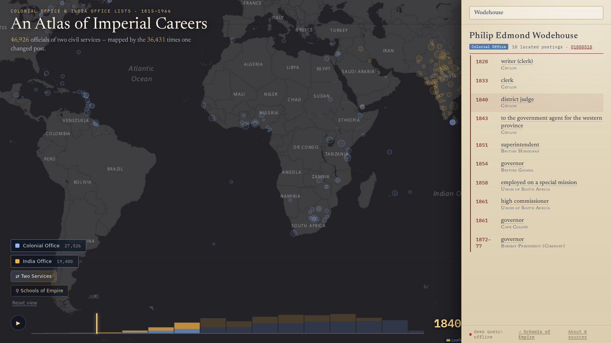

::: {.callout-note collapse="true" title="Terms on this page"}
- **coding agent**: a model that can read files, write and run code, and call tools, rather than only answer in chat.
- **pipeline**: the chain of scripts that turns the OCR text into the graph; run again when a rule changes.
- **arc**: one line on the atlas: one official moving from one posting to another.
- **Wikidata item, QID**: a shared identifier (Q plus a number) for a person or place, with its own facts attached.
- **F-score**: one number for how much a system found (recall) and how much of that was right (precision); it does not give either value separately.
- **gazetteer**: a list of place names with coordinates.
- **cache**: the saved results of earlier lookups, so they are not repeated and can be corrected in one place.
- **re-emit**: write the graph out again after a rule changes.

All terms: [glossary](../glossary.qmd).
:::

## Watch



This is an earlier atlas export, before the 7 October geography repairs. Fifty-six seconds. Every arc is one official moving from one colony, presidency or province to another, drawn from the career graph and played out by year, 1815 to 1966. The [interactive atlas](https://jimclifford.ca/col_matching/) behind it lets you search a name, follow a career, and open 186 proposed links between people in the Colonial and India Office records: [Philip Edmond Wodehouse](https://www.wikidata.org/wiki/Q1800510), Governor of British Guiana, then the Cape, then Bombay, is one of them, and a historian of the Cape and a historian of Bombay would each have known half of him.

The cross-service links are candidates: the September review found errors in a small check (11 of 15 links supported). Wodehouse is the worked example here; the full set of bridges needs further review.

What the atlas rests on, from the 4 September 2026 build:

| | |
|---|---|
| Person records in the roster (sum of both Lists) | 46,926 |
| Officials with at least one recorded move | 16,287 |
| Arcs drawn | 36,431 |

The video is an earlier export; use the table above for the September build counts. These arcs represent sequences of recorded postings, with many points placed at an administrative seat. They are not observed travel routes.

Every arc lands where it does because a place name printed in a Victorian reference book was linked to a Wikidata item that carries coordinates, or links to the capital that does. Every arc belongs to one person because forty annual entries were resolved to one biography. Every arc has a year because a clause like "ag. comsnr., 1915-16; and from 1919" was read as two events, not one. Those are the three questions of the hour, and each was decided tens of thousands of times by a model and a few hundred times by a historian.

## What one arc needs

Take one man who moved a lot. The 1867 *Colonial Office List* entry:

> WODEHOUSE, SIR PHILIP E., K.C.B. (Creat. 1862.)—Entered the Ceylon civil service as a writer, May, 1828; promoted to be assistant colonial secretary and clerk of the executive and legislative councils, Oct. 1833; district judge of Kandy, 1840; government agent for the western province, 1843; was appointed superintendent of Honduras, 1851; in Feb. 1854, governor of British Guiana; was employed in 1858 on a special mission to the government of Venezuela; and in 1861 was appointed governor of the Cape of Good Hope; is also high commissioner in South Africa.

The *India Office List* has him too, because he went on to govern Bombay from 1872 to 1877. To draw his arcs the pipeline had to answer the three questions of the hour for every clause: what is the event, which printed place is which real place, and whether the two Lists' entries are the same man.

| As printed | Event | Place, as printed | Identifier retrieved | Seat | Lat, long | Year |
|---|---|---|---|---|---|---|
| "Entered the Ceylon civil service as a writer, May, 1828" | writer | Ceylon | [Q918153](https://www.wikidata.org/wiki/Q918153) British Ceylon | Colombo | 6.93, 79.86 | 1828 |
| "district judge of Kandy, 1840" | district judge | Kandy | [Q203197](https://www.wikidata.org/wiki/Q203197) | (rolled up to Ceylon) | 7.29, 80.64 | 1840 |
| "superintendent of Honduras, 1851" | superintendent | British Honduras | [Q1643555](https://www.wikidata.org/wiki/Q1643555) | Belize | 17.5, −88.2 | 1851 |
| "governor of British Guiana" | governor | British Guiana | [Q918126](https://www.wikidata.org/wiki/Q918126) | Georgetown | 6.81, −58.15 | 1854 |
| "special mission to the government of Venezuela" | special mission | Venezuela | [Q717](https://www.wikidata.org/wiki/Q717) | Caracas, via the item's capital | 10.51, −66.91 | 1858 |
| "governor of the Cape of Good Hope" | governor | Cape Colony | [Q370736](https://www.wikidata.org/wiki/Q370736) | Cape Town | −33.93, 18.42 | 1861 |
| "governor of Bombay" (India Office List) | governor | Bombay Presidency | [Q891827](https://www.wikidata.org/wiki/Q891827) | Bombay | 18.97, 72.83 | 1872–77 |

The man himself is [Q1800510](https://www.wikidata.org/wiki/Q1800510), born 1811, died 1887. Every coordinate in the table came from Wikidata through the identifier: either the item carries a location, or it names a capital that does. Drawn in order of year:

## And what the map got wrong

The atlas's own panel for the same record, captured before the repairs on 7 October 2026:

Three rows were wrong. Each exposed a rule that needed repair:

- **1858, "employed on a special mission" → Union of South Africa.** The source says Venezuela. Venezuela is not a colony, so the event had no colony of its own and fell through to the next one. The rule that rolls placeless events forward needs a stop for foreign missions.
- **1861, "high commissioner" → Union of South Africa, seated at Bloemfontein.** The Union dates from 1910. In 1861 he was high commissioner *for* South Africa, from Cape Town. The surface "South Africa" was grounded to the twentieth-century state; the period entity is the office, not a polity. This one was made by a fix: the South Africa repair in [step 6](06-loop.qmd) sent the bare surface "South Africa" to the Union for every year.
- **1851, "Honduras" → seat Belmopan.** A capital founded in 1970. The seat table needs a date-aware entry for Belize Town.

The India Office record of the same man has a fourth: "superintendent of Honduras" inherits British Guiana, because its place was left empty and the inheritance rule filled it from the wrong direction. All four are now repaired in the [public atlas](https://jimclifford.ca/col_matching/?p=kgp_col1878-p447b3). The build uses explicit grounded places, checks dates, and never fills a missing location from the nearest appointment. British Honduras uses Belize City for these dates. The [wider audit](https://github.com/jburnford/col_matching/tree/master/research/geography-2026-10-07) checks both Lists and records corrections separately from candidates needing source review.

## The loop

The project did not go OCR, extract, visualise, publish. It went round a loop, many times:

1. **Build** the pipeline with a coding agent: segment the biographies, structure them, resolve duplicates, ground the places.
2. **Extract** the whole corpus with a cheap model inside that pipeline.
3. **Visualise** the result in the form the research question needs.
4. **See** what is wrong. A premier of British Columbia sitting in Australia. South African postings landing at Harare. Two Baluchistans.
5. **Fix** the rule, not the record. The fix goes into the grounding cache or the resolver, with a test.
6. **Rerun** and re-emit, and look again at everyone the fix touched, not only the case you noticed.

The atlas is step 3 and step 4 at once. It was built to answer a question about imperial mobility; it turned out to be the project's best error detector, because a wrong grounding is invisible in a table of 180,000 rows and obvious on a map. [Step 6](06-loop.qmd) walks through three of the errors it found.

## An earlier project

The same three problems at ten million pages: *Trading Consequences* (2012–2013) text-mined nineteenth-century commodity sources with the Edinburgh Geoparser, five institutions and a Digging into Data grant (Clifford, Alex, Coates, Klein and Watson, "Geoparsing history", *Historical Methods* 49:3, 2016, [doi:10.1080/01615440.2015.1116419](https://doi.org/10.1080/01615440.2015.1116419)).

| | Trading Consequences, 2013 | Imperial Careers, 2026 |
|---|---|---|
| **Structuring** | A six-stage pipeline adapted by computational linguists; a relation was "same sentence" | A schema and a prompt written with a coding agent in an afternoon; a Qwen model reads 100,000 entries inside the script |
| **Grounding** | GeoNames string matching; "Saharunpore" missed because the gazetteer knew "Saharanpur"; a bug put every "Italy" in a Texan town. F-scores of 0.62 for commodities and 0.61 for locations, combining precision and recall | Semantic search over Wikidata with verification gates; "Victoria" six ways; a bug put the Union of South Africa at Harare |
| **Review** | Historians spotted false positives through the visualisations; false negatives were invisible | Same. The atlas found the errors; a sampled audit measured the rest |

What changed is who writes the pipeline and how fast the loop from error to fix runs. What did not change is that the errors you can see get fixed, the errors you cannot see need a sample, and a corrected error should become a rule.

Next: [The source](02-source.qmd).
